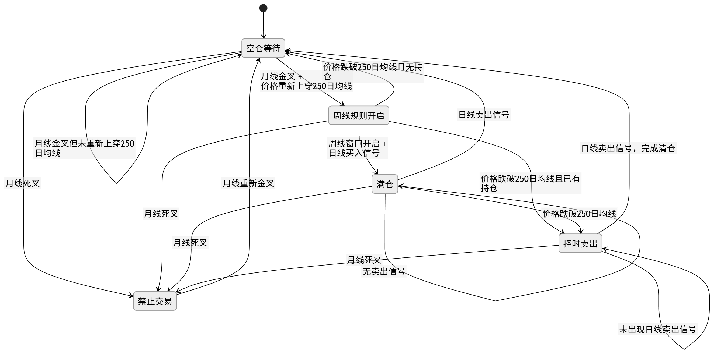
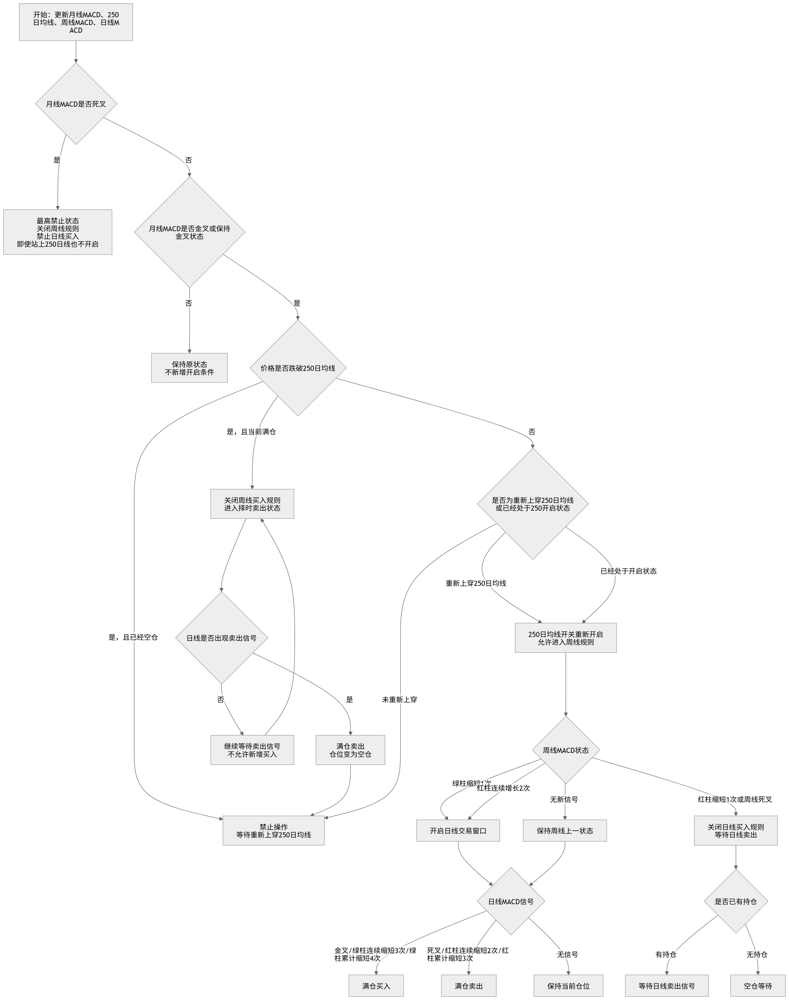
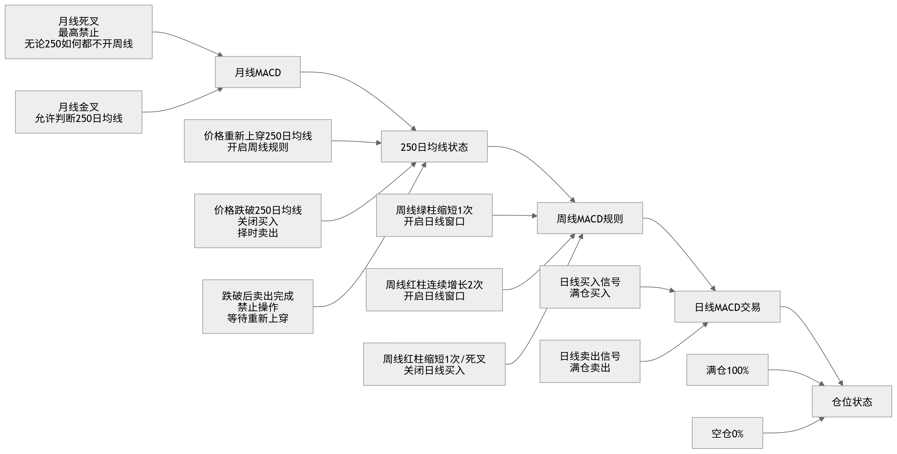
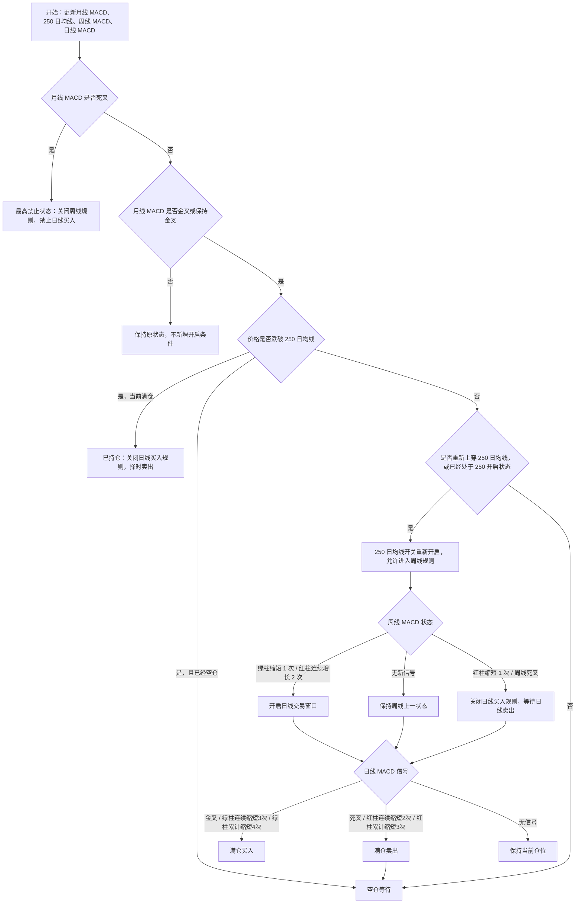

# 设计3：三周期 MACD + 250 日均线交易状态机

## 1. 相关设计图

本文件整理自同目录下的 4 张设计图：

## 2. 核心思路

本策略不是单一买卖点策略，而是一套“多周期状态控制 + 日线执行”的交易状态机。

整体优先级如下：

1. **月线 MACD**：最高级别趋势过滤器，决定系统是否允许进入后续规则。
2. **250 日均线**：长期趋势边界，决定是否允许开启周线规则。
3. **周线 MACD**：控制日线交易窗口是否打开。
4. **日线 MACD**：只负责具体买入、卖出和仓位执行。

简化理解：

- 月线死叉：最高禁止，不做买入。
- 月线金叉或保持金叉：允许观察 250 日均线。
- 价格重新上穿 250 日均线：开启周线规则。
- 周线条件允许：打开日线交易窗口。
- 日线 MACD 出现买入信号：满仓买入。
- 日线 MACD 出现卖出信号，或价格跌破 250 日均线：卖出或清仓。

## 3. 关键状态

| 状态 | 含义 | 是否允许买入 |
| --- | --- | --- |
| 月线死叉禁止 | 月线 MACD 死叉，系统进入最高禁止状态 | 否 |
| 空仓等待 | 当前无持仓，等待月线、250 日均线、周线窗口满足条件 | 否 |
| 等待重新上穿 250 日均线 | 月线允许，但价格尚未重新站上 250 日均线 | 否 |
| 周线规则开启 | 月线允许，且价格重新站上或已经站上 250 日均线 | 视周线窗口而定 |
| 日线交易窗口开启 | 周线 MACD 满足开启条件，允许日线信号执行 | 是 |
| 满仓 | 日线买入信号触发后持仓 100% | 否，等待卖出 |
| 日线卖出等待 | 已持仓，等待日线 MACD 卖出信号或 250 日均线破位 | 否 |
| 禁止操作 | 卖出完成或关键规则关闭，等待下一次重新上穿 250 日均线 | 否 |

## 4. 月线 MACD 规则

月线 MACD 是最高级别开关。

### 4.1 月线死叉

当月线 MACD 出现死叉：

- 系统进入最高禁止状态。
- 关闭周线规则。
- 关闭日线买入规则。
- 即使价格站上 250 日均线，也不允许重新开启周线规则。
- 如果已有持仓，需要进入风险处理流程，优先考虑减仓或清仓。

### 4.2 月线金叉或保持金叉

当月线 MACD 出现金叉，或保持金叉状态：

- 系统允许继续判断 250 日均线。
- 如果价格未站上 250 日均线，继续空仓等待。
- 如果价格重新站上 250 日均线，开启周线规则。

## 5. 250 日均线规则

250 日均线用于判断长期趋势边界。

### 5.1 重新上穿 250 日均线

当月线 MACD 允许，且价格重新上穿 250 日均线：

- 250 日均线状态变为允许。
- 开启周线 MACD 规则。
- 不立即买入，只允许进入周线和日线判断。

### 5.2 跌破 250 日均线

当价格跌破 250 日均线：

- 如果当前空仓：继续等待，不允许买入。
- 如果当前持仓：关闭日线买入规则，择时卖出或清仓。
- 卖出完成后进入禁止操作状态，等待下一次重新上穿 250 日均线。

## 6. 周线 MACD 规则

周线 MACD 负责控制日线交易窗口。

### 6.1 周线窗口开启

当满足以下任一条件时，开启日线交易窗口：

- 周线 MACD 绿柱缩短 1 次。
- 周线 MACD 红柱连续增长 2 次。

开启后：

- 允许日线 MACD 买入信号生效。
- 不代表立即买入，仍要等待日线买入信号。

### 6.2 周线窗口关闭

当满足以下任一条件时，关闭日线买入规则：

- 周线 MACD 红柱缩短 1 次。
- 周线 MACD 出现死叉。

关闭后：

- 如果无持仓：空仓等待。
- 如果已有持仓：等待日线卖出信号。
- 不再接受新的日线买入信号。

## 7. 日线 MACD 交易规则

日线 MACD 是实际执行层。

### 7.1 买入规则

只有在以下条件同时满足时，才允许买入：

1. 月线 MACD 未死叉，且处于金叉或保持金叉状态。
2. 价格已经重新站上或保持在 250 日均线之上。
3. 周线交易窗口已经开启。
4. 当前为空仓。
5. 日线 MACD 出现买入信号。

买入动作：

- 满仓买入。
- 仓位状态变为 100%。
- 进入持仓监控状态。

### 7.2 卖出规则

出现以下任一情况时，需要卖出或清仓：

- 日线 MACD 出现卖出信号。
- 价格跌破 250 日均线且已有持仓。
- 周线规则关闭后，后续日线出现卖出信号。
- 月线 MACD 死叉，触发最高级别风险控制。

卖出动作：

- 满仓卖出。
- 仓位状态变为 0%。
- 进入空仓等待或禁止操作状态。

## 8. 主流程整理

## 9. 模块拆分建议

后续实现时，可以拆成 4 层模块。

### 9.1 指标计算层

负责计算：

- 月线 MACD。
- 周线 MACD。
- 日线 MACD。
- 250 日均线。
- 价格是否站上或跌破 250 日均线。
- MACD 柱体连续增长或缩短次数。

### 9.2 状态机层

负责维护：

- 月线允许状态。
- 250 日均线状态。
- 周线交易窗口状态。
- 日线交易窗口状态。
- 仓位状态。
- 禁止交易状态。

### 9.3 信号生成层

负责输出：

- `BUY_FULL`：满仓买入。
- `SELL_FULL`：满仓卖出。
- `HOLD`：保持当前仓位。
- `WAIT`：空仓等待。
- `DISABLE_BUY`：禁止买入。
- `FORCE_RISK_CONTROL`：高级别风险控制。

### 9.4 执行与展示层

负责：

- 在前端展示当前状态。
- 展示月线、周线、日线信号来源。
- 展示当前是否允许买入。
- 展示当前是否已有持仓。
- 展示下一步等待条件。

## 10. 建议的数据字段

| 字段 | 说明 |
| --- | --- |
| `monthly_macd_state` | 月线 MACD 状态：金叉、死叉、保持金叉、保持死叉 |
| `above_ma250` | 当前价格是否在 250 日均线之上 |
| `ma250_cross_up` | 是否重新上穿 250 日均线 |
| `ma250_cross_down` | 是否跌破 250 日均线 |
| `weekly_window_open` | 周线是否允许打开日线交易窗口 |
| `daily_window_open` | 日线交易窗口是否开启 |
| `position_pct` | 当前仓位比例，0 或 100 |
| `daily_macd_signal` | 日线 MACD 信号：买入、卖出、无信号 |
| `trade_action` | 最终交易动作 |
| `next_waiting_condition` | 当前等待的下一条件 |

## 11. 待确认细节

下面这些点建议在编码前进一步明确：

1. 月线死叉时，如果已有持仓，是立即清仓，还是等待日线卖出信号。
2. “择时卖出”的具体定义：用日线死叉、跌破 250 日均线当日收盘、还是次日开盘。
3. 周线绿柱缩短 1 次是否必须发生在 250 日均线重新开启之后。
4. 周线红柱连续增长 2 次的统计是否允许跨越周线死叉。
5. 日线买入信号中“绿柱连续缩短 3 次”和“绿柱累计缩短 4 次”的优先级。
6. 满仓买入是否固定为 100%，是否后续允许分批。
7. 回测时使用收盘价成交，还是下一交易日开盘价成交。

## 12. 当前版本结论

设计3可以总结为：

> 月线定大方向，250 日均线定长期开关，周线定交易窗口，日线定买卖执行。

这套规则的重点不是频繁预测短线涨跌，而是通过多周期过滤减少逆势交易：

- 大周期不允许时，不做。
- 长期趋势未恢复时，不做。
- 周线窗口未打开时，不做。
- 只有日线信号在正确窗口内出现时，才执行买卖。
